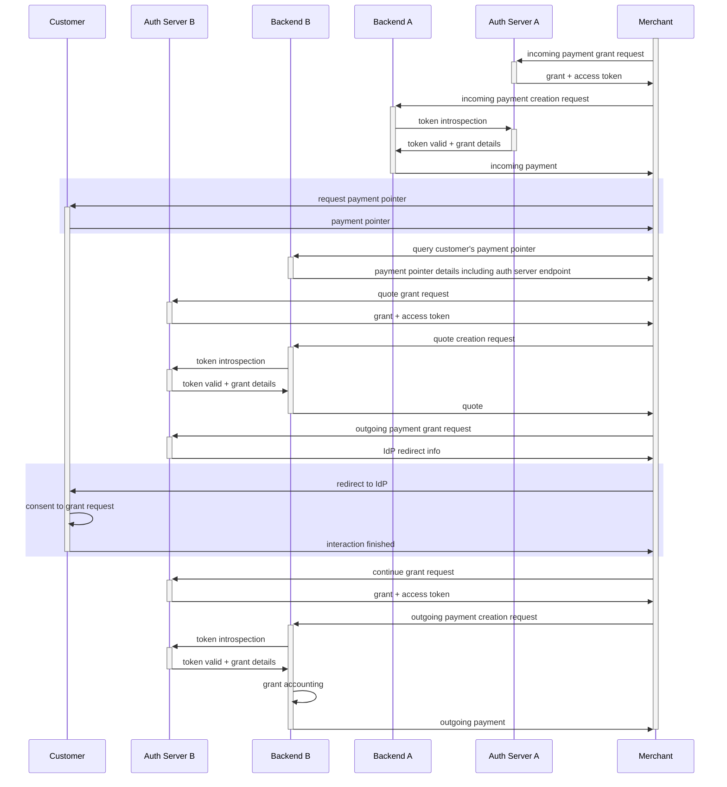

import { LinkOut, MermaidWrapper } from '@interledger/docs-design-system'

<MermaidWrapper client:load>

```mermaid
sequenceDiagram

participant Cu as Customer
participant A2 as Auth Server B
participant R2 as Backend B
participant R1 as Backend A
participant A1 as Auth Server A
participant Cl as Merchant

activate Cl
Cl->>+A1: incoming payment grant request
A1->>-Cl: grant + access token
Cl->>+R1: incoming payment creation request
R1->>+A1: token introspection
A1->>-R1: token valid + grant details
R1->>-Cl: incoming payment
rect rgba(0, 0, 255, .1)
Cl->>+Cu: request payment pointer
Cu->>Cl: payment pointer
end
Cl->>+R2: query customer's payment pointer
R2->>-Cl: payment pointer details including auth server endpoint
Cl->>+A2: quote grant request
A2->>-Cl: grant + access token
Cl->>+R2: quote creation request
R2->>+A2: token introspection
A2->>-R2: token valid + grant details
R2->>-Cl: quote
Cl->>+A2: outgoing payment grant request
A2->>-Cl: IdP redirect info
rect rgba(0, 0, 255, .1)
Cl->>Cu: redirect to IdP
Cu->>Cu: consent to grant request
Cu->>-Cl: interaction finished
end
Cl->>+A2: continue grant request
A2->>-Cl: grant + access token
Cl->>+R2: outgoing payment creation request
R2->>+A2: token introspection
A2->>-R2: token valid + grant details
R2->>R2: grant accounting
R2->>-Cl: outgoing payment
deactivate Cl
```

</MermaidWrapper>
