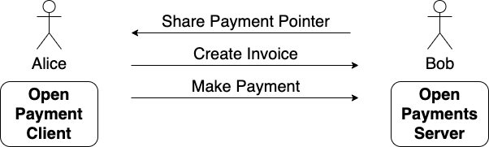
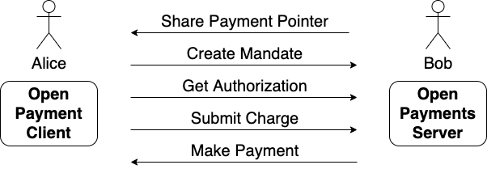

import { PersonToPerson } from './personToPerson'
import { RequestToPay } from './requestToPay'

At the heart of all interactions in Open Payments is an account that is either
the sending or receiving side of the transaction. As this account is the
starting point for any interactions we call this the **initiation account**.

If the **Open Payments Client** is the **payer** then the **initiation account**
is the **payee account**.

If the **Open Payments Client** is the **payee** then the **initiation account**
is the **payer account**.

In the following example of a person-to-person payment from Alice to Bob,
Alice's wallet is the client and therefor Bob's account is the **initiation
account**.



However, in the second example Alice is the payee and uses Bob's Payment Pointer
to discover his account (the initiation account) and create and authorize a
mandate to pull funds from it.



## Payment Pointers

All entities in Open Payments are identified by, and can be addressed via, URLs
and we call the URLs identifying accounts **Payment Pointer URL**s.

> Example Payment Pointer URL:  
> `https://wallet.example/accounts/dee69df8-be40-478f-9828-6267f4d42b01`

To make Payment Pointer URLs shorter and easier to transcribe they can be
encoded as a **[Payment Pointer](https://paymentpointers.org)**. In this form
they also have the advantage of being easily and unambiguously recognizable as
Payment Pointers.

> Example Payment Pointer:  
> `$wallet.example/accounts/dee69df8-be40-478f-9828-6267f4d42b01`

[Wallets](./terminology#wallet) that support Open Payments will define one or
more unique Payment Pointer URLs for each account they service on behalf of the
owner.

The rules for encoding and decoding Payment Pointers are defined at
[paymentpointers.org](https://paymentpointers.org).

### Personal Payment Pointers

In many cases a user will have multiple accounts and will register a single
short and easy to transcribe **Personal Payment Pointer** which they link to
their default account. This Personal Payment Pointer can then be easily
exchanged with counter-parties when initiating a payment (either as sender or
receiver).

> Example Personal Payment Pointer:  
> `$wallet.example/alice`

Personal Payment Pointers are analogous to an email address or payment card
number. Email addresses are given to counter-parties so that they can begin
sending emails to the target inbox. Similarly, a payment card number can be
given to a counter-party so that they can request payment from the target
account.

Users can share their Personal Payment Pointers to both get paid and make
payments using Open Payments.

Importantly, a Payment Pointer is not sensitive in the same way that a payment
card number is. It can be shared freely with no risk that funds will be pulled
from the target account without the account owner's consent

## Metadata

Account metadata is provided by an Open Payments Server as a JSON document that
describes the various service endpoints that are available to:

- connect to the account via Interledger
- get authorization to perform actions on the account (using OAuth 2.0)
- get more information about the owner of the account (using OpenID Connect)
- create invoices and mandates that are linked to the account

The document is hosted at the Payment Pointer URL.

To access the document a client MUST make an HTTP GET request to the Payment
Pointer URL specifying an accepted media type of `application/json`.

The following request is a non-normative example of a request for the meta-data
for the account identified by the Payment Pointer: `$wallet.example/alice`

```http
GET /alice HTTP/1.1
Host: wallet.example
Accept: application/json
```

The returned JSON document MUST contain one or more of the following claims:

- `account_servicer` URL identifying the entity servicing the account (e.g.
  bank, digital wallet, mobile money provider).

- `assets_supported` A list of asset definitions for assets that can be used to
  create agreements on this server. The schema of an asset definition is defined
  in [Assets](#assets).

If the Open Payments server supports authorization of clients via OAuth2 this
document MAY contain claims as defined in
[RFC8414 Section 2](https://tools.ietf.org/html/rfc8414#section-2).

> TODO: Should the OAuth Server meta-data be returned under a root element like
> `authorization`

Other claims MAY also be returned.

Claims that return multiple values are represented as JSON arrays. Claims with
zero elements MUST be omitted from the response.

An error response uses the applicable HTTP status code value.

The following is a non-normative example response:

```http
HTTP/1.1 200 OK
Content-Type: application/json

{
  "account_servicer": "https://wallet.example",
  "authorization_endpoint": "https://auth.wallet.example/authorize",
  "token_endpoint": "https://auth.wallet.example/token",
  "assets_supported": [
    {"code": "USD", "scale": 2},
    {"code": "EUR", "scale": 2}
  ]
}
```

## Simple Payment Setup Protocol Fallback

Open Payments discovery is designed to be backwards compatible with the previous
Interledger setup protocol
[SPSP](https://interledger.org/rfcs/0009-simple-payment-setup-protocol/).

SPSP defines behaviour of an SPSP Server when receiving an HTTP `GET` at the
Payment Pointer URL, however it mandates that the request must use an accepted
media-type of `application/spsp4+json`.

If an Open Payments client makes a meta-data request (using the
`application/json` media-type) and receives an error this suggests that the
server does not support Open Payments.

If a raw Interledger connection is sufficient to accomplish the transaction it
is attempting, the client MAY fall back to using SPSP and retry the request in
the form of a backwards-compatible
[Open Payments Connection Request](web-monetization.mdx) which supports both
SPSP and Open Payments.
